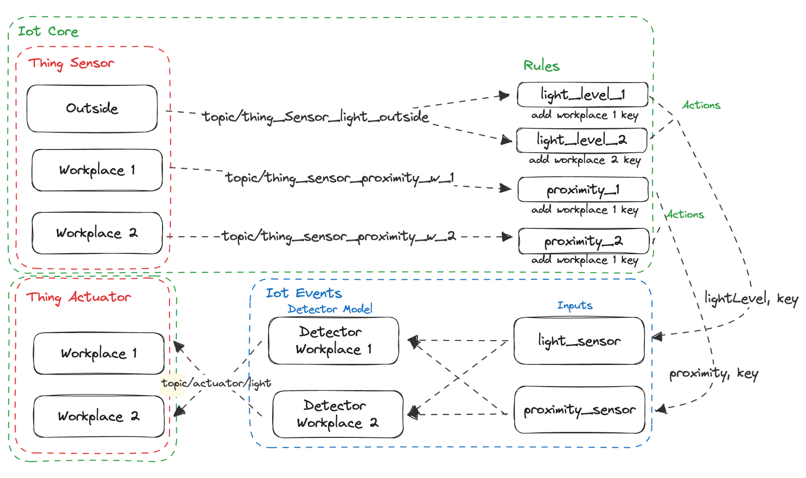

# Lighttomorrow

## Project Idea
Lighttomorrow is an innovative IoT solution, designed and developed during the 'Cloud and Internet of Things' course at the Hochschule der Medien, Stuttgart. This project harnesses the power of AWS to control IoT devices, facilitating intelligent energy consumption in corporate environments. The core feature of Lighttomorrow is a proximity sensor that triggers the desk light to illuminate when a person approaches. Further, the system takes into consideration external light conditions, preventing unnecessary use of artificial light during daylight hours. The main intent of Lighttomorrow is to assist businesses in significantly reducing their energy expenditure on lighting, promoting a greener and more sustainable future.

## Team Members
- Christos Kafkalis
- Michael Cabanis
- Marco de Jesus António
- Marvin Pfau
- Timo Waldherr

## Getting Started / Setup Instructions


#### 1. Setup Terraform

```sh
export GITLAB_ACCESS_TOKEN=
terraform init \
    -backend-config="address=https://gitlab.mi.hdm-stuttgart.de/api/v4/projects/9068/terraform/state/default" \
    -backend-config="lock_address=https://gitlab.mi.hdm-stuttgart.de/api/v4/projects/9068/terraform/state/default/lock" \
    -backend-config="unlock_address=https://gitlab.mi.hdm-stuttgart.de/api/v4/projects/9068/terraform/state/default/lock" \
    -backend-config="username=mc071" \
    -backend-config="password=$GITLAB_ACCESS_TOKEN" \
    -backend-config="lock_method=POST" \
    -backend-config="unlock_method=DELETE" \
    -backend-config="retry_wait_min=5"

```

#### 2. Run terraform apply

```sh
export AWS_ACCESS_KEY_ID=
export AWS_DEFAULT_REGION=
export AWS_SECRET_ACCESS_KEY=
terraform apply
```

## Developing Progress
Explain Dev Progress and Solutions

## Architecture Diagram


## Learnings
- Some Services require delay in setup

- Challenging Docs

- Limited StackOverflow responses

- Long deletion time

- Vast number of services


