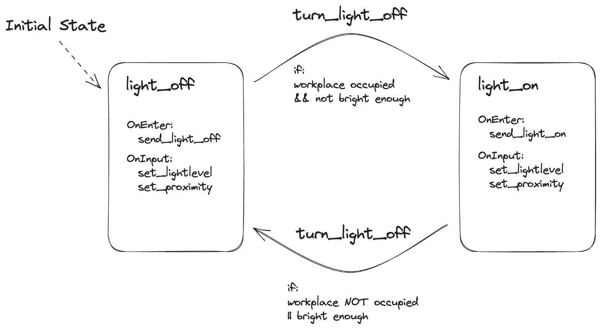

# LightTomorrow

## Project Idea

LightTomorrow is an IoT solution, designed and developed during the 'Cloud and Internet of Things' course at the Hochschule der Medien, Stuttgart.

This project harnesses the power of AWS to control IoT devices, facilitating intelligent energy consumption in corporate environments.

The core feature of LightTomorrow is a proximity sensor that triggers the desk light to illuminate when a person approaches. Further, the system takes into consideration external light conditions, preventing unnecessary use of artificial light during daylight hours. The main intent of LightTomorrow is to assist businesses in significantly reducing their energy expenditure on lighting, promoting a greener and more sustainable future.

## Team Members

- Christos Kafkalis (ck188)
- Michael Cabanis (mc071)
- Marco de Jesus António (md131)
- Marvin Pfau (mp159)
- Timo Waldherr (tw086)

## Software Parts

### Infrastructure for Backend

- AWS to build software backend: AWS Iot Core, AWS Iot Events (No Lambda)
- Logic of actuators built with Detector Model (AWS Iot Events)
- Terraform using GitLab Backend to save state

[Getting started](./infrastructure/README.md)

### Gateway

- TypeScript Node Software for all required things
- 100% code coverage
- Testing and packing in CI

[Getting started](./gateway/README.md)

## Developing Progress

## Architecture & Data flow Diagram

## Detector Model Business Logic

## Learnings

- When to use cloud services / Use cases for cloud services
- Thinking in cloud services + which services are available + concepts of services
- What Infrastructure as code is + benefits of using it (we love it!)
- Basics of Iot devices (MQTT, problems)
- Details about the AWS IoT Core and AWS IoT Events
